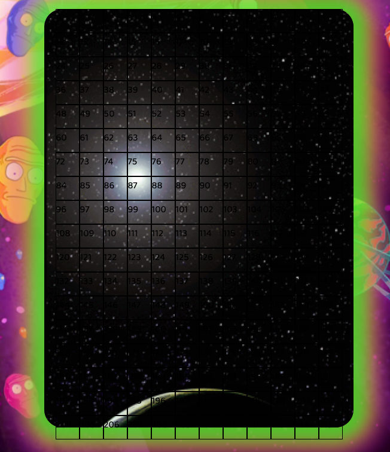
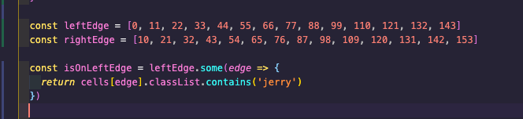
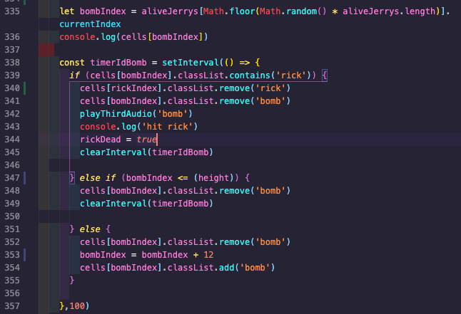
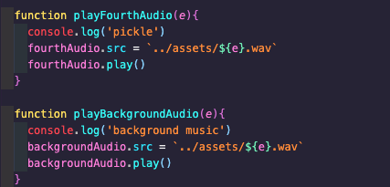
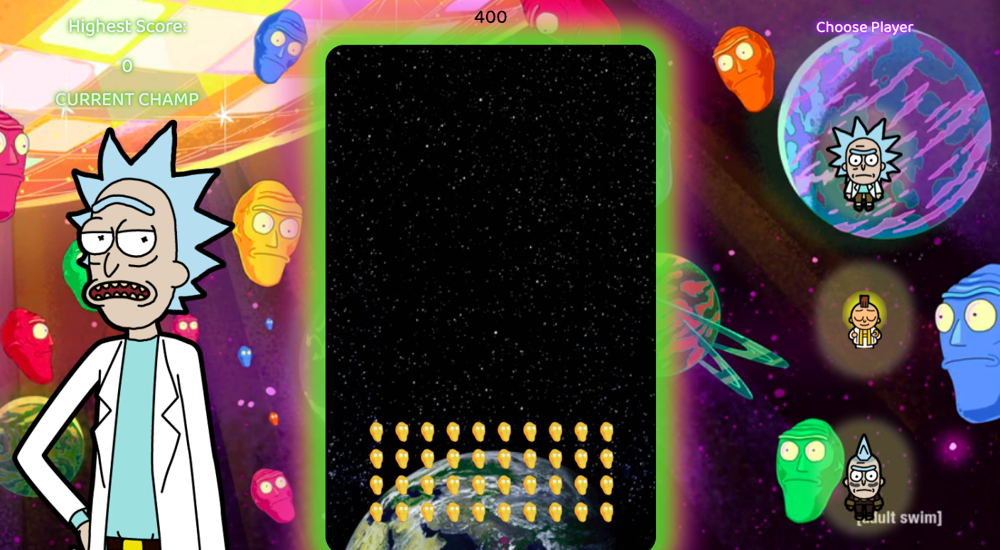

# *sei-project-1*
# **Cromulon Invaders**

About Space Invaders: An arcade game created by Japanese engineer and game designer Nishikado Tomohiro in 1978 and produced by Japanese electronic game manufacturer Taito Corp. The objective of Space Invaders, which was one of the earliest video games released, is to pan across a screen and shoot descending swarms of aliens, preventing them from reaching the bottom of the screen. It is viewed as a pioneer of modern gaming.

Project 1: Space Invaders - Rick and Morty Theme
Space invaders is an old school arcade style game. Mine being browser-based. The aim of the game is to shoot all the invading aliens using the spacebar before they reach you while dodging their incoming fire using the left and right arrow keys. 

This was my first project I did at General Assembly for the Software Immersive Course, built in 8 days. It's also my first ever game I have built and real-life practice of the skills we had been learning for only a month.
You can check it out here :
https://a-der.github.io/sei-project-1/

Or checkout the GitHub repo here to download:
https://github.com/A-Der/sei-project-1

# Brief
- Render the game in the browser
- Select difficulty level by selecting which character to be
- Have a single player who pans across the bottom of the game grid and can shoot the enemy
- Have an army of enemies who pan across the grid and down towards the player
- The enemies should randomly drop bombs at the player and the player should be able to shoot the enemy
- Create logic to determine if the player has won or lost the game
- Created using HTML, CSS and JavaScript only
- Deploy online

# Technologies Used
- HTML5 with Audio
- CSS
- JavaScript (ES6)
- GitHub
- Git
- Google Fonts

# **My Approach** # 

# Initial grid and players/enemies on screen
The first thing I did was to pseudo code my initial plan to get a visual picture of what would be my foundation/structure and then how to go about arranging the more functional parts of the game. 
I initially divided my pseudo code into 'Shoot Logic', 'Start Game Logic' and 'Movement Logic'.
For example, I thought the best way to display my players/enemies would be to create a grid as an array of divs. These divs were neatly packed together in a rectangular flex-box and each enemy or the player were displayed as having a CSS class assigned to that specific div. Enemies being multiples in an array of their own. Next, designing the function of their movement would be based off of this static grid.

# Movement
The movement for the player was very straight forward. The left arrow key would trigger the removal of the CSS class of the players image; - 1 from their index; then apply again the CSS image. It would be + 1 for the right arrow key and the keys would do nothing if the index of the player was at either edge of the grid and trying to go off the grid.

Movement for the enemies was more complex. I first defined the left and right edge of the grid. These were 2 separate arrays of the indexes of the divs on the left and right edge of the grid. 
Then using if statements I moved my array of enemies, starting from the left combined with timers, until hitting the right edge. The logic being; if the right edge contains a class of enemy, and 'direction' = 'r', then add the grids width to all the indexes of the enemies, so as to display them as moving downwards in a vertical move. The purpose of the variable 'direction' is to differentiate between the enemies being on the right edge and needing to move down or the enemies being on the right edge and needing to move left; when the enemies move down a grids width the 'direction' is changed to 'l', which in the function means that it must now go left instead of jumping down again. I then had other if statements in the same function to move my enemies - 1 repeatedly until hitting the left edge and so on until they either all get killed or hit the bottom row (where the player is) resulting in game over.

# Shooting and enemies bombing
For both the shots from my player to the enemies and bombs dropped from my enemies towards the player I used very similar logic for both.

When my player shoots, my function starts a timer, takes the current index of my player and starting from 1 row above him (minusing 1 width as we are working from the bottom up) and assigns a CSS image of a laser shot while also triggering audio. This CSS image would continue minusing the width and removing/adding the CSS image, going up the screen and at each instance would ask if the next div contains a class of the enemies. If it did, then that enemy would die, the timer Id would be cleared and points added to the score. If the laser reaches the top of the grid without hitting any enemies then the timer Id would also be cleared but no points added.

For the bombs being dropped I used the exact same technique, a timer Id that goes across the screen very fast checking whether there is a class of the player in the div. This time though the bombs were being dropped from random enemies. I achieved this by using an array to filter out the enemies who were still alive and using Math.Random/Math.floor and multiplying it by the array length to get a random index of the array of alive enemies. I would then assign the bomb index as the current value + width and again, keep repeating this until it hits the player or the bottom of the grid. This bombs function was also wrapped in another timer so that bombs would be dropping continuously while the game is still being played.

 # Audio 
 I really liked the idea of my game having plenty of audio, for lasers, for bombs, for choosing a character, for dying, for winning a level and having background music. I soon discovered I needed multiple audio tags otherwise they would all just cut each other off if using the same on. So I figured out what was the least amount of audio tags I needed to make it work and which ones should be called for which function so as not to be cutting each other off For example, I would not use the same audio tag for the players shooting and also if an enemy dies as they would most certainly clash. 

 

# Bugs

In the middle of the grid the enemies move down before going once more to the left to be at the edge, basically missing out one specific column. This has to do with my enemies movement logic and defining when they should be jumping down or moving left or right.

# Wins and Challenges
My biggest obstacle by far was the movement of the enemies, keeping their image from reloading after dying and having the army of enemies still follow the movement function according to the enemies left alive and not by how many there were in total, which would always remain the same. I did this by turning my enemies into objects with a Current Index and Is Alive properties. So after one would be hit, the Is Alive property would be turned to false. 
It was eye opening to see actually just how simple a game could be. The removal of just the CSS image to show one had died was so simple I was annoyed it wasn’t more obvious to me in the first place.

My biggest accomplishment was the hours of trial and error I endured, although I got to a dead end many many times and spent copious amounts of time still digging in said dead end, I learned a lot about the methods, functions and how they work, their uses and limits, while also picking up useful ways to use said methods that I perhaps hadn’t thought of before which I can carry forward into my work. 
Having a solid experience building in vanilla JavaScript was an awesome way to really get to grips with the fundamentals of programming.

# Future Content
Things I would like to implement:
- Use media queries so this game can played on phones/tablets
- Being able to spawn more armies
- A bonus mother ship enemy to randomly be deployed throughout the game
- Other game modes where the enemies are non-stop and speed up over time
- A better scoreboard to keep track of previous scores not just the highest one overall
- 2nd player mode using W,S,D keys so 2 people can play at once and use the shift button to shoot for the second player.

# Key Learnings
- As this was my first ever project there were a lot of valuable experiences I had in only 8 days. Most notably for me was the value of pseudo coding as much as necessary in the initial stages as opposed to figuring it out along the way (which I had experimented in class labs previously). This really created a blueprint in my brain to follow and found the actual construction of the app much more seamless.
- I also learnt how effective it is to step back from a problem I was stuck on as opposed to wrestling with it until exhaustion. I felt like I would be giving up if I were to stop when it was unsolved. Through more experience I realised how quickly things can make themselves clear when you give it some breathing space and come back with fresh eyes and perhaps more research on the web.
